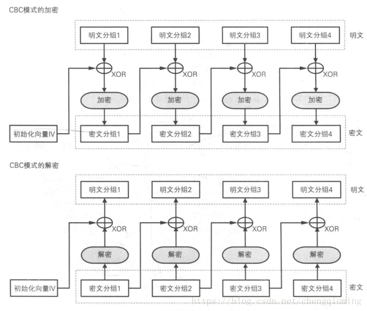

# Crypto

## 佛说，让你签个到

### 考查要点

1. 与佛论禅

### 解题过程

使用与佛论禅对密文进行解密，获得明文`关注SCUCTF公众号回复SCUCTF2019获得Flag`，关注公众号发送指定消息即可获得 flag。

## 512 位 RSA

### 考查要点

1. RSA
2. 脚本编写

### 解题过程

1. 题目给出的已知条件有 d，n 和 e，要求计算 p+q 的哈希值。
2. 先计算 $k=d*e-1$，即 $k$ 为 $\varphi(n)$ 的倍数
3. 随机生成一个位于 1 到 n 之间的 g，如果$k\ mod\ 2=1$，就重新生成一个 g，
4. 将 k 除以二，变为原来的一半，计算$y=g^k\ mod\ n$
5. 当 y 不为 1，即 k 不是 n 的欧拉函数的倍数，且 y-1 和 n 不互素时，p 和 q 中其中一个为 y-1 和 p 的最大公因数。
6. 如果 y 为 1 或者 y-1 与 n 互素，就重新进行第四步。
7. 如果$k\ mod\ 2=1$，就重新执行第三步。

```python
import random
import hashlib
from pwn import *


def gcd(a, b):
    if a < b:
        a, b = b, a
    while b != 0:
        temp = a % b
        a = b
        b = temp
    return a


def getpq(n, e, d):
    p = 1
    q = 1
    while p == 1 and q == 1:
        k = d * e - 1
        g = random.randint(0, n)
        while p == 1 and q == 1 and k % 2 == 0:
            k /= 2
            y = pow(g, k, n)
            if y != 1 and gcd(y - 1, n) > 1:
                p = gcd(y - 1, n)
                q = n / p
    return p, q


def main(n, e, d):
    p, q = getpq(n, e, d)
    md5 = hashlib.md5()
    md5.update(str(p + q))
    return md5.hexdigest()


def get_flag(host, port):
    sh=remote(host,port)
    n=sh.recvline()
    n=n.split("> ")[1]
    n=eval(n)
    e=sh.recvline()
    e=e.split("> ")[1]
    e=eval(e)
    d=sh.recvline()
    d=d.split("> ")[1]
    d=eval(d)
    result=main(n,e,d)
    sh.sendline(result)
    print sh.recvline()


if __name__ == '__main__':
    get_flag("120.78.66.77",16000)
```

## X 计划

### 考查要点

1. CBC 模式下的字节反转攻击

### 解题过程

1. 收到一个 16 字节的明文和 CBC 模式下使用 DES，随机 key 和 iv 加密的密文，需要输入一个密文，使之使用相同的方式解密结果末尾为 XXXX
2. DES 的分组为 8 字节一组，16 字节刚好两个分组，接下来看 CBC 模式的加密原理：
   
3. 即我们只要将第一个密文分组的后四字节，与第二个明文分组的后四字节异或，再和四个 X 异或，即可让解密之后的第二个明文分组后四个字节为 X。

```python
# -*- coding: utf-8 -*-
from Crypto.Util.number import long_to_bytes

cipher=long_to_bytes(0x5dcebc74db3fb32b93f6fa4d5c9ec1e506b894a8f424e54)
plain="wdzRBU7eyBqU4Hm4"
cipher=bytearray(cipher)
cipher[4]=cipher[4]^ord(plain[12])^ord("X")
cipher[5]=cipher[5]^ord(plain[13])^ord("X")
cipher[6]=cipher[6]^ord(plain[14])^ord("X")
cipher[7]=cipher[7]^ord(plain[15])^ord("X")
result=""
for i in cipher:
    if len(hex(i))==4:
        result+=hex(i)[-2:]
    else:
        result+="0"+hex(i)[-1:]
result="0x"+result
print result
```
